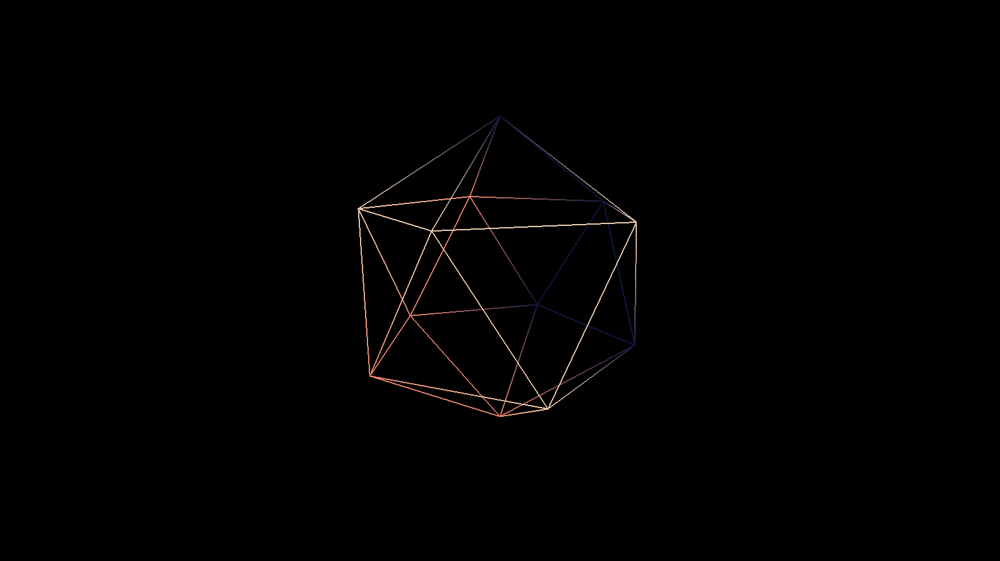

# OpenGL Icosahedron

A minimalistic OpenGL project that renders an animation of rotating 3D icosahedron. Built as a learning exercise to explore the core concepts of modern graphics programming.

## Key features
- **Procedural animation** using custom mathematical functions
- **Multi-layered movement** combining Bézier curves, smooth interpolation, and exponential function

## Requirements for build:
    - Visual Studio build tools or VisualStudio 2022

## Build & Run
1.  **Clone:** `git clone https://github.com/TheRealBaron/icosahedron.git`
2.  **Open:** Launch `OpenGL.sln` in Visual Studio (2022 or later).
3.  **Run:** Press `F5`.

## Project Goals
The main goal was to understand the setup and use of:
- OpenGL function loading with GLAD.
- Compiling and using custom GLSL shaders.
- Implementing a basic game loop with delta time.
